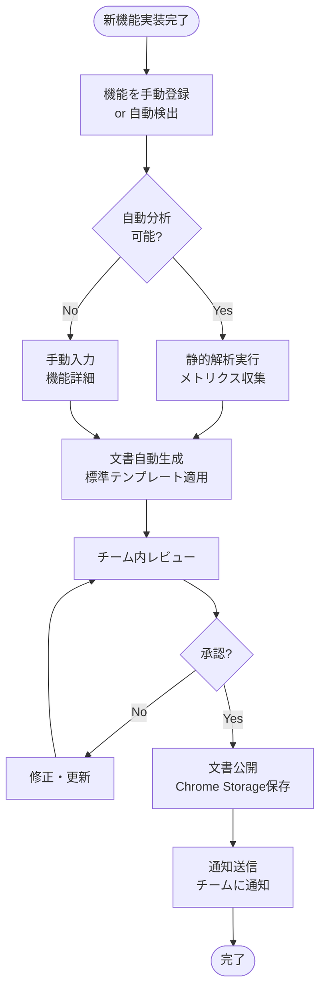

# Design Document

## Overview

SightEdit Chrome Extensionの機能整理と改善計画を実現するため、包括的なドキュメントシステムを構築する。

**目的**: 既存機能の体系的な分析、品質評価、改善計画策定、継続的な監視を一元的に管理し、プロダクトの持続的成長を支援する。

**ユーザー**: プロダクトマネージャー、開発チーム、QAエンジニア、ステークホルダーがこのシステムを活用し、機能の現状把握、品質評価、改善計画策定、進捗監視を行う。

**影響**: 既存のSightEdit Chrome Extensionに新しいドキュメントシステムを追加する。既存の開発ワークフローに統合され、継続的な品質改善サイクルを確立する。

### ゴール
- 全機能の包括的なインベントリと詳細な文書化の実現
- 客観的品質メトリクスに基づく現状分析とギャップ特定
- データドリブンな改善計画策定と優先順位付け
- 継続的な品質監視と改善効果測定の自動化
- 長期的な機能拡張ロードマップの策定

### 非ゴール
- 既存エディター機能の変更や置き換え
- リアルタイムユーザー行動トラッキング（プライバシー配慮）
- 外部SaaSツールへの依存（Chrome Extension内で完結）
- 自動コード生成や自動リファクタリング

## Architecture

### 既存アーキテクチャ分析

SightEdit Chrome Extensionは以下の確立されたアーキテクチャパターンを持つ：

**既存の構造パターン**:
- Chrome Extension Manifest V3アーキテクチャ（Popup、Background Service Worker、Editor）
- 単一責任原則に基づくモジュール分割（`src/lib/`, `src/common/`）
- Chrome Storage APIによる設定・データ管理
- Webpackによるモジュールバンドリング

**尊重すべきドメイン境界**:
- `src/editor/`: エディターコア機能（触らない）
- `src/lib/`: 独立ライブラリモジュール（再利用可能）
- `src/common/`: 共通ユーティリティ（拡張可能）
- `src/background/`: Service Worker処理（最小限の変更）

**維持すべき統合ポイント**:
- Chrome Storage APIの使用パターン
- Webpack エントリポイント設定
- Jest テスト構造
- 国際化リソース管理（`src/i18n/`）

**対処する技術債務**:
- TypeScript未導入（段階的移行を計画）
- テストカバレッジ不足（カバレッジ向上を目標）
- 文書化の不統一（このシステムで解決）

### 高レベルアーキテクチャ


**アーキテクチャ統合**:
- **既存パターンの保持**: Chrome Extension Manifest V3構造、モジュール分割パターン、Storage API使用パターンを維持
- **新規コンポーネントの理由**: ドキュメントシステムは独立した新ドメインとして`src/documentation-system/`に配置
- **技術整合性**: JavaScript ES6+、Webpack、Jest、Chrome Storage APIという既存スタックを活用
- **ステアリング準拠**: structure.md（kebab-case命名、モジュール分割）、tech.md（技術スタック）、product.md（プロダクト戦略Phase 2）に準拠

### 技術整合性

**既存技術スタックとの整合**:
- **言語**: JavaScript ES6+ (既存と同じ、段階的TypeScript移行を計画)
- **ビルドツール**: Webpack 5.101.3 (プラグインとして統合)
- **テストフレームワーク**: Jest 30.1.3 (カスタムレポーターで連携)
- **ストレージ**: Chrome Storage API (sync/local, 既存パターン踏襲)
- **命名規則**: kebab-case (structure.md準拠)

**新規導入依存関係**:
- **ESLint/SonarQube API**: コード品質分析用（開発依存関係）
- **Chrome DevTools Protocol**: パフォーマンス測定用（Chrome組み込み）
- **Chart.js**: メトリクス可視化用（軽量チャートライブラリ、~50KB）

**既存パターンからの逸脱**:
なし。すべて既存の技術スタックとパターンに準拠。

### 重要な設計判断

#### 決定1: Chrome Extension内蔵 vs 外部SaaS

**コンテキスト**: ドキュメントシステムをどこで実装・実行するか。

**選択肢**:
1. Chrome Extension内に完全内蔵
2. 外部SaaS（Notion、Confluence等）連携
3. ローカルデスクトップアプリケーション

**選択アプローチ**: Chrome Extension内に完全内蔵

**理由**:
- SightEditのセキュリティ原則（ローカル処理優先、外部依存最小化）に準拠
- Chrome Storage APIで十分な容量（sync: 100KB, local: 5MB）
- 追加インストール不要、ユーザー体験の一貫性維持
- オフライン動作可能

**トレードオフ**:
- **獲得**: セキュリティ、プライバシー、オフライン動作、追加コスト不要
- **犠牲**: チーム間共有機能、大規模データ処理能力、外部ツール統合

#### 決定2: リアルタイム分析 vs バッチ処理

**コンテキスト**: コードベース分析とメトリクス収集のタイミング。

**選択肢**:
1. ファイル保存時にリアルタイム分析
2. 定期的なバッチ処理（日次/週次）
3. 手動トリガーによるオンデマンド分析

**選択アプローチ**: ハイブリッド方式（軽量な分析はリアルタイム、重量な分析はバッチ/手動）

**理由**:
- Chrome Extension Service Workerの制約（長時間実行不可）
- パフォーマンス要件（ユーザー体験を阻害しない）
- 開発ワークフローとの統合（Git hooks、Webpack plugins）

**実装**:
- **リアルタイム**: ファイル保存時の基本的なメトリクス更新（<100ms）
- **バッチ**: ビルド時の包括的分析（Webpack plugin、<30秒）
- **手動**: 詳細レポート生成（ユーザートリガー、<60秒）

**トレードオフ**:
- **獲得**: レスポンシブな体験、パフォーマンス維持、柔軟性
- **犠牲**: 完全なリアルタイム性、実装の複雑さ増加

#### 決定3: データモデル設計（正規化 vs 非正規化）

**コンテキスト**: Chrome Storage内のデータ構造設計。

**選択肢**:
1. 正規化（リレーショナル様式、参照による結合）
2. 非正規化（ドキュメント様式、埋め込み）
3. ハイブリッド（頻繁アクセスは非正規化、履歴は正規化）

**選択アプローチ**: ハイブリッド方式

**理由**:
- Chrome Storage APIはキー・バリュー型（リレーショナルDBではない）
- 読み取り性能優先（機能インベントリ、メトリクス表示は頻繁）
- ストレージ容量制約（5MB local storage）

**実装**:
- **非正規化**: 機能インベントリ、最新メトリクス（高速読み取り）
- **正規化**: 履歴データ、変更ログ（容量効率）
- **インデックス**: カテゴリ別、優先度別の検索キー

**トレードオフ**:
- **獲得**: 読み取り性能、シンプルなクエリ、容量効率
- **犠牲**: データ一貫性管理の複雑さ、更新時の多重書き込み

## System Flows

### ワークフロー1: 定期的機能レビュー


### ワークフロー2: ビルド時の自動分析


### ワークフロー3: 新機能追加時の文書化



## Requirements Traceability

| 要件 | 要件概要 | 実現コンポーネント | インターフェース | フロー |
|------|----------|-------------------|----------------|-------|
| 1 | 機能インベントリの作成 | Feature Inventory Manager | `analyzeUIComponents()`, `documentAPIEndpoints()` | - |
| 2 | 現状分析とギャップ特定 | Analysis Engine | `detectTechnicalDebt()`, `analyzePerformance()` | ワークフロー2 |
| 3 | 品質基準の策定 | Quality Assessment System | `calculateQualityScore()`, `defineKPIs()` | - |
| 4 | 改善計画の優先順位策定 | Planning Framework | `prioritizePlans()`, `allocateResources()` | ワークフロー1 |
| 5 | 機能拡張ロードマップの策定 | Roadmap Generator | `analyzeMarketTrends()`, `definePhasePlans()` | - |
| 6 | 文書化標準とメンテナンス体制 | Documentation Standards | `generateDocumentation()`, `validateConsistency()` | ワークフロー3 |
| 7 | 実装品質の継続的監視 | Monitoring Dashboard | `trackMetrics()`, `generateReports()` | ワークフロー1 |

## Components and Interfaces

### ドキュメントシステムコア

#### Feature Inventory Manager

**責任と境界**:
- **主な責任**: SightEditの全機能（UI、API、データフロー）の分類・管理
- **ドメイン境界**: 機能カタログドメイン（読み取り専用分析）
- **データ所有権**: 機能インベントリデータ、依存関係グラフ
- **トランザクション境界**: 単一機能の登録・更新

**依存関係**:
- **インバウンド**: Monitoring Dashboard、Planning Framework
- **アウトバウンド**: Analysis Engine、Chrome Storage API
- **外部**: Chrome Extension DOM API（UI要素解析）

**サービスインターフェース**:
```typescript
interface FeatureInventoryService {
  analyzeUIComponents(): Promise<UIComponent[]>;
  documentAPIEndpoints(): Promise<APIEndpoint[]>;
  generateDataFlowDiagram(): Promise<DataFlowDiagram>;
  identifyDependencies(): Promise<Dependency[]>;
  registerFeature(feature: FeatureMetadata): Promise<void>;
}

type FeatureMetadata = {
  id: string;
  name: string;
  category: 'Editor' | 'AI' | 'Extension' | 'Storage' | 'UI';
  description: string;
  implementationStatus: 'Implemented' | 'Partial' | 'Planned';
};
```

#### Analysis Engine

**責任と境界**:
- **主な責任**: コードベースの静的解析、技術債務検出、パフォーマンス測定
- **ドメイン境界**: 分析・評価ドメイン（バッチ処理）
- **データ所有権**: 分析結果、技術債務レポート
- **トランザクション境界**: 単一分析セッション

**依存関係**:
- **インバウンド**: Webpack Plugin、Quality Assessment System
- **アウトバウンド**: ESLint API、Chrome DevTools Protocol
- **外部**: SonarQube API（オプション）

**サービスインターフェース**:
```typescript
interface AnalysisEngineService {
  detectTechnicalDebt(): Promise<TechnicalDebtReport>;
  analyzePerformance(): Promise<PerformanceReport>;
  assessSecurity(): Promise<SecurityReport>;
  measureCodeQuality(files: string[]): Promise<CodeQualityReport>;
}

type CodeQualityReport = {
  complexity: number;
  duplication: number;
  testCoverage: number;
  lintIssues: LintIssue[];
};
```

#### Quality Assessment System

**責任と境界**:
- **主な責任**: 品質スコア算出、KPI追跡、ベンチマーク比較
- **ドメイン境界**: 品質評価ドメイン（メトリクス集約）
- **データ所有権**: 品質スコア、KPIデータ、履歴トレンド
- **トランザクション境界**: 単一メトリクス更新

**サービスインターフェース**:
```typescript
interface QualityAssessmentService {
  calculateQualityScore(featureId: string): Promise<QualityScore>;
  defineKPIs(featureId: string): Promise<KPI[]>;
  trackMetrics(): Promise<MetricTrackingReport>;
  measureImprovementImpact(planId: string): Promise<ImpactReport>;
}

type QualityScore = {
  overall: number; // 1-10
  codeQuality: number;
  testCoverage: number;
  security: number;
  performance: number;
  userSatisfaction: number;
};
```

#### Planning Framework & Roadmap Generator

**責任と境界**:
- **主な責任**: 改善計画策定、優先順位付け、ロードマップ生成
- **ドメイン境界**: 戦略計画ドメイン（意思決定支援）
- **データ所有権**: 改善計画、実装ロードマップ
- **トランザクション境界**: 計画セッション全体

**サービスインターフェース**:
```typescript
interface PlanningService {
  prioritizePlans(plans: ImprovementPlan[]): Promise<PrioritizedPlan[]>;
  allocateResources(plans: PrioritizedPlan[]): Promise<ResourceAllocation>;
  generateRoadmap(timeframe: string): Promise<Roadmap>;
}

type ImprovementPlan = {
  id: string;
  title: string;
  priority: 'Critical' | 'High' | 'Medium' | 'Low';
  effortEstimate: 'Small' | 'Medium' | 'Large' | 'XLarge';
  businessImpact: 'High' | 'Medium' | 'Low';
  technicalRisk: 'High' | 'Medium' | 'Low';
};
```

#### Documentation Standards & Monitoring Dashboard

**責任と境界**:
- **主な責任**: 文書化標準管理、自動文書生成、継続的監視
- **ドメイン境界**: 文書化・レポーティングドメイン（UI層）
- **データ所有権**: 文書テンプレート、生成済み文書、ダッシュボード設定
- **トランザクション境界**: 文書生成セッション、ダッシュボード更新

**サービスインターフェース**:
```typescript
interface DocumentationService {
  generateDocumentation(feature: Feature): Promise<Document>;
  validateConsistency(document: Document): Promise<ValidationResult>;
  publishDocument(document: Document): Promise<void>;
}

interface MonitoringService {
  trackMetrics(): Promise<MetricSnapshot>;
  generateReports(type: ReportType): Promise<Report>;
  alertOnQualityDegradation(): Promise<void>;
}
```

**統合戦略**:
- **変更アプローチ**: 新規ドメインとして`src/documentation-system/`に追加（既存コード変更なし）
- **後方互換性**: 既存のビルドプロセス、テストプロセスに影響なし
- **移行パス**: フェーズ1（基盤）→フェーズ2（分析）→フェーズ3（自動化）の段階的導入

## Data Models

### 物理データモデル（Chrome Storage）

**ストレージ戦略**: ハイブリッド方式（頻繁アクセスは非正規化、履歴は正規化）

#### chrome.storage.local構造

```typescript
// 機能インベントリ（非正規化、高速読み取り）
type FeatureInventoryData = {
  features: {
    [featureId: string]: {
      id: string;
      name: string;
      category: 'Editor' | 'AI' | 'Extension' | 'Storage' | 'UI';
      description: string;
      implementationStatus: 'Implemented' | 'Partial' | 'Planned';
      qualityScore: number; // 1-10
      usageFrequency: 'High' | 'Medium' | 'Low';
      lastUpdated: string; // ISO 8601
      dependencies: string[]; // Feature IDs
    };
  };
  categories: {
    [category: string]: string[]; // Feature IDs
  };
  lastSync: string; // ISO 8601
};

// 品質メトリクス（非正規化）
type QualityMetricsData = {
  metrics: {
    [featureId: string]: {
      featureId: string;
      codeQuality: number; // 1-10
      testCoverage: number; // 0-100%
      securityScore: number; // 1-10
      performanceScore: number; // 1-10
      userSatisfaction: number; // 1-10
      technicalDebtLevel: 'Critical' | 'High' | 'Medium' | 'Low';
      measuredAt: string; // ISO 8601
    };
  };
};

// 改善計画（正規化）
type ImprovementPlansData = {
  plans: {
    [planId: string]: {
      id: string;
      title: string;
      priority: 'Critical' | 'High' | 'Medium' | 'Low';
      effortEstimate: 'Small' | 'Medium' | 'Large' | 'XLarge';
      businessImpact: 'High' | 'Medium' | 'Low';
      technicalRisk: 'High' | 'Medium' | 'Low';
      implementationPhase: 'Short-term' | 'Medium-term' | 'Long-term';
      dependencies: string[]; // Plan IDs
      successCriteria: string[];
      status: 'Planned' | 'InProgress' | 'Completed' | 'Blocked';
      createdAt: string;
      updatedAt: string;
    };
  };
};

// 履歴データ（正規化、容量効率）
type HistoryData = {
  qualityHistory: {
    [featureId: string]: Array<{
      timestamp: string;
      qualityScore: number;
    }>;
  };
  changeLog: Array<{
    timestamp: string;
    type: 'feature_added' | 'metric_updated' | 'plan_created';
    entityId: string;
    changes: Record<string, unknown>;
  }>;
};
```

#### IndexedDB（大規模データ）

大規模な分析結果やレポートはIndexedDBに保存：

```typescript
// ObjectStores
const stores = {
  analysisReports: { keyPath: 'id', indexes: ['createdAt', 'type'] },
  documents: { keyPath: 'id', indexes: ['featureId', 'createdAt'] },
  exportData: { keyPath: 'id', indexes: ['exportedAt'] }
};
```

### データ整合性とマイグレーション

**整合性制約**:
- Feature IDは必ずユニーク（UUID v4使用）
- 依存関係は循環参照を禁止（DAG検証）
- メトリクスは対応するFeatureが存在する場合のみ保存

**バージョン管理**:
```typescript
type StorageVersion = {
  version: string; // semver
  lastMigration: string; // ISO 8601
};

// Migration handlers
const migrations = {
  '1.0.0-to-1.1.0': migrateFeaturesSchema,
  '1.1.0-to-2.0.0': migrateToIndexedDB
};
```

##Error Handling

### エラー戦略

ドキュメントシステムは以下のエラー戦略を採用：

1. **防御的プログラミング**: 外部データ（Chrome Storage、コード解析結果）の検証
2. **Graceful Degradation**: 一部機能の失敗が全体に影響しない設計
3. **明示的エラー型**: ResultまたはEither型による型安全なエラー処理
4. **ユーザー通知**: 技術的詳細を隠し、アクション可能なメッセージを表示

### エラーカテゴリと対応

#### ユーザーエラー（4xx相当）

| エラータイプ | 原因 | 対応 |
|------------|------|------|
| InvalidInput | 不正な機能登録データ | フィールドレベル検証エラー表示、修正ガイダンス |
| FeatureNotFound | 存在しない機能IDの参照 | 機能一覧へのナビゲーション、再検索提案 |
| DuplicateFeature | 既存機能の重複登録 | 既存機能の編集画面へ誘導 |

#### システムエラー（5xx相当）

| エラータイプ | 原因 | 対応 |
|------------|------|------|
| StorageQuotaExceeded | Chrome Storage容量超過 | 古いデータの削除提案、エクスポート推奨 |
| AnalysisTimeout | 分析処理のタイムアウト | バッチ処理へのフォールバック、進捗通知 |
| ExternalAPIFailure | ESLint/SonarQube API障害 | ローカル分析へのフォールバック、再試行ボタン |

#### ビジネスロジックエラー（422相当）

| エラータイプ | 原因 | 対応 |
|------------|------|------|
| CircularDependency | 機能間の循環依存検出 | 依存関係グラフ表示、解消ガイド |
| InsufficientData | 分析に必要なデータ不足 | データ収集手順の表示、手動入力オプション |
| ConflictingPriorities | 改善計画の優先順位競合 | 競合の視覚化、手動調整インターフェース |

### エラーハンドリング実装

```typescript
// Result型による型安全なエラー処理
type Result<T, E = Error> =
  | { ok: true; value: T }
  | { ok: false; error: E };

// エラーコード体系
enum ErrorCode {
  // User Errors
  INVALID_INPUT = 'DOC_ERR_001',
  FEATURE_NOT_FOUND = 'DOC_ERR_002',
  DUPLICATE_FEATURE = 'DOC_ERR_003',

  // System Errors
  STORAGE_QUOTA_EXCEEDED = 'DOC_ERR_101',
  ANALYSIS_TIMEOUT = 'DOC_ERR_102',
  EXTERNAL_API_FAILURE = 'DOC_ERR_103',

  // Business Logic Errors
  CIRCULAR_DEPENDENCY = 'DOC_ERR_201',
  INSUFFICIENT_DATA = 'DOC_ERR_202',
  CONFLICTING_PRIORITIES = 'DOC_ERR_203'
}

// エラーハンドリング例
async function registerFeature(metadata: FeatureMetadata): Promise<Result<void>> {
  // 入力検証
  const validation = validateFeatureMetadata(metadata);
  if (!validation.ok) {
    return { ok: false, error: new ValidationError(ErrorCode.INVALID_INPUT, validation.errors) };
  }

  // 重複チェック
  const existing = await storage.getFeature(metadata.id);
  if (existing) {
    return { ok: false, error: new DuplicateError(ErrorCode.DUPLICATE_FEATURE, metadata.id) };
  }

  // 保存
  try {
    await storage.saveFeature(metadata);
    return { ok: true, value: undefined };
  } catch (error) {
    if (error instanceof QuotaExceededError) {
      return { ok: false, error: new StorageError(ErrorCode.STORAGE_QUOTA_EXCEEDED) };
    }
    throw error; // 予期しないエラーは上位で処理
  }
}
```

### 監視とロギング

**ログレベル**:
- **ERROR**: システムエラー、外部API障害（通知必要）
- **WARN**: ビジネスロジックエラー、リソース制約警告
- **INFO**: 正常な操作完了、重要なイベント
- **DEBUG**: 詳細な実行トレース（開発時のみ）

**ロギング実装**:
```typescript
interface Logger {
  error(code: ErrorCode, error: Error, context?: Record<string, unknown>): void;
  warn(message: string, context?: Record<string, unknown>): void;
  info(message: string, context?: Record<string, unknown>): void;
  debug(message: string, context?: Record<string, unknown>): void;
}

// Chrome Extension環境でのロギング
const logger: Logger = {
  error: (code, error, context) => {
    console.error(`[${code}]`, error.message, context);
    // 必要に応じてChrome Storageに保存（エラーレポート機能）
  },
  warn: (message, context) => console.warn(message, context),
  info: (message, context) => console.log(message, context),
  debug: (message, context) => console.debug(message, context)
};
```

## Testing Strategy

### ユニットテスト

**カバレッジ目標**: 90%+（コア分析ロジック）

**テスト対象**:
- **Feature Inventory Manager**: 機能登録、検索、依存関係解析
- **Analysis Engine**: コード品質測定、技術債務検出アルゴリズム
- **Quality Assessment System**: スコア算出ロジック、KPI集約
- **Planning Framework**: 優先順位付けアルゴリズム、リソース配分

**テストフレームワーク**: Jest 30.1.3（既存と同じ）

**テスト例**:
```javascript
describe('FeatureInventoryManager', () => {
  describe('registerFeature', () => {
    test('新規機能の登録が成功する', async () => {
      const metadata = { id: 'feat-001', name: 'AI Integration', ... };
      const result = await inventoryManager.registerFeature(metadata);
      expect(result.ok).toBe(true);
    });

    test('重複機能の登録はエラーを返す', async () => {
      const metadata = { id: 'existing-feat', ... };
      const result = await inventoryManager.registerFeature(metadata);
      expect(result.ok).toBe(false);
      expect(result.error.code).toBe(ErrorCode.DUPLICATE_FEATURE);
    });

    test('循環依存を検出する', async () => {
      const feat1 = { id: 'f1', dependencies: ['f2'] };
      const feat2 = { id: 'f2', dependencies: ['f1'] };
      const result = await inventoryManager.detectCircularDependencies([feat1, feat2]);
      expect(result.hasCycle).toBe(true);
    });
  });
});
```

### 統合テスト

**対象フロー**:
- **ビルド時分析フロー**: Webpack → Analysis Engine → Feature Inventory → Chrome Storage
- **ダッシュボード表示フロー**: Chrome Storage → Monitoring Dashboard → Chart.js可視化
- **文書生成フロー**: Feature Inventory → Documentation Standards → Markdown生成 → Chrome Storage

**テスト環境**: Jest + jsdom（Chrome API Mocking）

**テスト例**:
```javascript
describe('ビルド時分析フロー', () => {
  test('完全な分析サイクルが正常に動作する', async () => {
    // Webpack plugin起動
    const plugin = new DocumentationAnalysisPlugin();
    await plugin.apply(mockCompiler);

    // 分析実行
    await mockCompiler.hooks.done.promise({ compilation: mockCompilation });

    // 結果検証
    const features = await storage.getAllFeatures();
    expect(features.length).toBeGreaterThan(0);
    expect(features[0]).toHaveProperty('qualityScore');
  });
});
```

### End-to-Endテスト

**重要ユーザーパス**:
- プロダクトマネージャーが月次レビューダッシュボードを表示
- 開発者がビルド実行後に分析レポートを確認
- 新機能追加時に自動文書生成が実行される

**テストツール**: Playwright（Chrome Extensionテスト対応）

### パフォーマンステスト

**目標メトリクス**:
- 完全なコードベース分析: <30秒
- ダッシュボード読み込み: <1秒
- メモリ使用量: <100MB追加
- ストレージ使用量: <50MB

**負荷テスト**:
- 1000機能のインベントリ読み込み性能
- 並行分析処理のスループット
- 長期間の履歴データ蓄積シナリオ

## Security Considerations

### データプライバシー

**原則**: すべての分析データはローカル（Chrome Storage/IndexedDB）に保存し、外部送信なし

**取り扱いデータ**:
- コードベース情報（機能名、ファイル名、複雑度メトリクス）
- 品質スコア、技術債務評価
- 改善計画、ロードマップ

**プライバシー保護**:
- ユーザー同意なしの外部送信禁止
- エクスポート機能は明示的なユーザーアクション必須
- センシティブな情報（APIキー、認証情報）の分析対象外

### Chrome Extension セキュリティ

**Manifest V3準拠**:
```json
{
  "manifest_version": 3,
  "permissions": ["storage"],
  "host_permissions": []
}
```

**Content Security Policy**:
- インラインスクリプト禁止（`script-src 'self'`）
- 外部リソース読み込み最小化
- Chart.jsはローカルバンドル版使用

### 外部依存関係のセキュリティ

**依存関係管理**:
- ESLint/SonarQube API使用時のAPIキー安全管理（Chrome Storage暗号化）
- npm audit定期実行（脆弱性検出）
- 最小限の依存関係（Chart.jsのみ追加）

**サプライチェーンセキュリティ**:
- package-lock.jsonコミット（依存関係固定）
- 信頼できるレジストリのみ使用（npm公式）
- 定期的な依存関係更新とセキュリティパッチ適用

## Performance & Scalability

### パフォーマンス最適化戦略

**目標**:
- 分析処理: コードベース全体<30秒
- UI応答性: ダッシュボード操作<100ms
- メモリ効率: 追加メモリ使用<100MB
- ストレージ効率: <50MB local storage使用

**最適化手法**:

1. **遅延読み込み（Lazy Loading）**:
   - ダッシュボードコンポーネントのオンデマンド読み込み
   - 大規模レポートの段階的レンダリング
   - Chart.jsの動的インポート

2. **インクリメンタル分析**:
   - 変更されたファイルのみ再分析
   - 差分更新によるメトリクス計算
   - キャッシュを活用した重複分析回避

3. **バックグラウンド処理**:
   - Chrome Extension Service Workerでの非同期分析
   - Web Workerによる重い計算のオフロード
   - プログレス通知による体感速度向上

4. **データ圧縮**:
   - 履歴データのLZ圧縮
   - 冗長データの正規化
   - 古いデータの自動アーカイブ

### スケーラビリティ設計

**スケーリング制約**:
- Chrome Storage local: 5MB上限
- IndexedDB: ブラウザ依存（通常50MB+）
- Service Worker実行時間: 30秒制約

**スケーリング戦略**:

1. **データアーカイブ**:
   - 90日以上前の履歴データを圧縮アーカイブ
   - エクスポート機能によるオフライン保存
   - 必要時の再インポート機能

2. **段階的分析**:
   - Phase 1: 重要機能のみ（80/20ルール）
   - Phase 2: 全機能の基本メトリクス
   - Phase 3: 詳細分析（オンデマンド）

3. **容量監視とアラート**:
   - ストレージ使用率90%でアラート
   - 自動クリーンアップ提案
   - データエクスポート推奨

### キャッシュ戦略

**キャッシュ対象**:
- 機能インベントリ（メモリキャッシュ、5分TTL）
- 最新品質スコア（メモリキャッシュ、1分TTL）
- 分析結果（Chrome Storage、24時間TTL）

**無効化戦略**:
- コードベース変更検出時に関連キャッシュを無効化
- ビルド実行時に全キャッシュをクリア
- 手動リフレッシュボタンでの即時無効化

