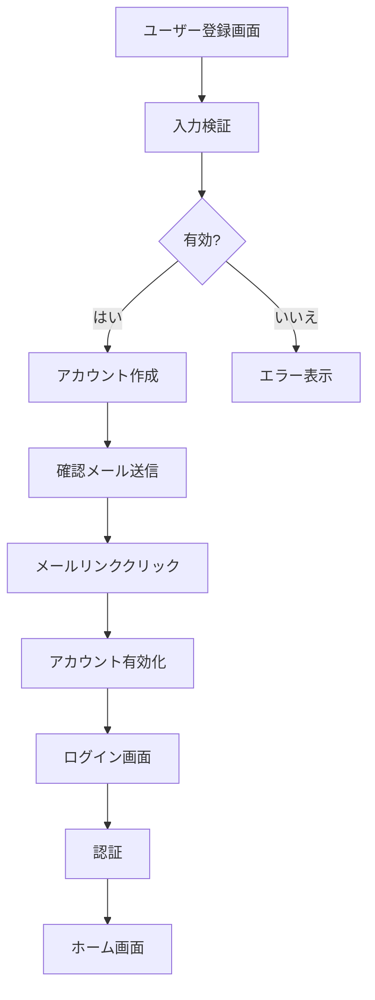

# SightEdit - 機能詳細 | Feature Details

**日本語:** SightEdit Chrome Extensionの全機能の詳細説明です。

**English:** Detailed description of all features in SightEdit Chrome Extension.

---

## 📝 エディター機能 | Editor Features

### WYSIWYGモード | WYSIWYG Mode

**日本語:**
- **見たままの編集**: Markdownの記号を意識せずに編集
- **リッチテキスト編集**: 太字、斜体、取り消し線、コードなど
- **インライン編集**: テキストを選択して直接フォーマット変更
- **リアルタイムレンダリング**: 入力と同時に結果を表示

**English:**
- **What-you-see-is-what-you-get editing**: Edit without worrying about Markdown syntax
- **Rich text editing**: Bold, italic, strikethrough, code, etc.
- **Inline editing**: Select text and change formatting directly
- **Real-time rendering**: Display results as you type

---

### ソースモード | Source Mode

**日本語:**
- **Markdown記法の直接編集**: プレーンテキストでの編集
- **シンタックスハイライト**: Markdown記法の視覚的強調
- **行番号表示**: コードエディター風の表示
- **ショートカット対応**: Markdown記号の素早い入力

**English:**
- **Direct Markdown editing**: Plain text editing
- **Syntax highlighting**: Visual emphasis of Markdown syntax
- **Line numbers**: Code editor-style display
- **Shortcut support**: Quick input of Markdown symbols

---

### 基本編集機能 | Basic Editing Features

**日本語:**
- **見出し**: H1〜H6レベル
- **リスト**: 箇条書き、番号付きリスト
- **引用**: ブロッククオート
- **コードブロック**: シンタックスハイライト付き
- **表**: Markdownテーブル
- **水平線**: セクション区切り
- **リンク**: URLとテキストのリンク
- **画像**: 3種類の挿入方法（後述）

**English:**
- **Headings**: H1-H6 levels
- **Lists**: Bullet points, numbered lists
- **Quotes**: Block quotes
- **Code blocks**: With syntax highlighting
- **Tables**: Markdown tables
- **Horizontal rules**: Section dividers
- **Links**: URL and text links
- **Images**: 3 insertion methods (described later)

---

### ツールバー | Toolbar

**日本語:**
- **直感的操作**: クリックでMarkdown要素を挿入
- **アイコンベース**: 分かりやすいビジュアル表示
- **レスポンシブ**: 画面サイズに応じたレイアウト調整

**English:**
- **Intuitive operation**: Insert Markdown elements with a click
- **Icon-based**: Clear visual display
- **Responsive**: Layout adjustment according to screen size

---

## 🤖 AI機能 | AI Features

### 対応AIプロバイダー | Supported AI Providers

#### Google Gemini

**日本語:**
- **Gemini 2.5 Pro** (推奨): 高性能・無料枠あり
- **Gemini 2.0 Flash**: 最新・高速・無料枠あり
- **Gemini 2.0 Flash Exp**: 実験版・最新機能
- **Gemini 1.5 Flash**: 高速・無料枠あり
- **Gemini 1.5 Pro**: 高性能・無料枠あり

**English:**
- **Gemini 2.5 Pro** (recommended): High performance, free tier available
- **Gemini 2.0 Flash**: Latest, fast, free tier available
- **Gemini 2.0 Flash Exp**: Experimental version with latest features
- **Gemini 1.5 Flash**: Fast, free tier available
- **Gemini 1.5 Pro**: High performance, free tier available

---

#### Anthropic Claude

**日本語:**
- **Claude Sonnet 4**: Artifacts対応・認証不要（一部機能）
- **Claude Haiku**: 高速・コスト効率
- **Claude Opus**: 最高性能

**English:**
- **Claude Sonnet 4**: Artifacts support, no authentication required (some features)
- **Claude Haiku**: Fast, cost-efficient
- **Claude Opus**: Best performance

---

### AIチャット機能 | AI Chat Features

#### 基本機能 | Basic Features

**日本語:**
- **リアルタイムストリーミング**: 応答が逐次表示
- **Markdown対応**: リッチテキストで応答表示
- **コードブロック**: シンタックスハイライト付き
- **XSS保護**: DOMPurifyによる安全な表示

**English:**
- **Real-time streaming**: Responses displayed incrementally
- **Markdown support**: Rich text response display
- **Code blocks**: With syntax highlighting
- **XSS protection**: Safe display with DOMPurify

---

#### コンテキスト連携 | Context Integration

**日本語:**
- **なし**: 単独の質問・会話
- **選択範囲**: 選択したテキストを含めて質問
- **ドキュメント全体**: 文書全体をコンテキストとして使用

**English:**
- **None**: Independent questions/conversations
- **Selection**: Include selected text with question
- **Entire document**: Use entire document as context

---

#### 会話履歴管理 | Conversation History Management

**日本語:**
- **IndexedDB保存**: ローカルに永続化
- **セッション管理**: 複数の会話を個別管理
- **お気に入り**: 重要な会話をマーク
- **検索機能**: タイトルや内容で検索
- **フィルター**: すべて/お気に入り/今日/今週

**English:**
- **IndexedDB storage**: Local persistence
- **Session management**: Manage multiple conversations individually
- **Favorites**: Mark important conversations
- **Search functionality**: Search by title or content
- **Filters**: All/favorites/today/this week

---

#### キーボードショートカット | Keyboard Shortcuts

**日本語:**
- `Ctrl+K` (Cmd+K): チャットパネルのトグル
- `Ctrl+L` (Cmd+L): 会話クリア
- `Ctrl+Enter`: メッセージ送信

**English:**
- `Ctrl+K` (Cmd+K): Toggle chat panel
- `Ctrl+L` (Cmd+L): Clear conversation
- `Ctrl+Enter`: Send message

---

### AI編集機能 | AI Editing Features

#### テキスト処理 | Text Processing

**日本語:**
- **要約**: 長文を簡潔にまとめる
- **校正**: 誤字脱字・文法チェック
- **翻訳**: 英語⇔日本語の双方向翻訳

**English:**
- **Summarize**: Condense long texts concisely
- **Proofread**: Spelling and grammar check
- **Translate**: Bidirectional English ⇔ Japanese translation

---

#### 文体変換（20+種類） | Writing Style Conversion (20+ types)

**日本語:**
1. **エッセイ調**: 穏やかで涼気な文体
2. **論文調**: 学術的で厳格な文体
3. **ビジネス調**: フォーマルなビジネス文体
4. **カジュアル調**: 親しみやすい口調
5. **丁寧語調**: より丁寧な敬語表現
6. **簡潔調**: 簡潔で要点を絞った表現
7. **詳細調**: より詳しく具体的な説明
8. **説明調**: 分かりやすい解説口調
9. **感情豊か調**: 感情表現豊かな文体
10. **客観調**: 客観的で中立的な表現
11. **主観調**: 個人的な意見を含む表現
12. **専門用語調**: 専門的な用語を使用
13. **一般向け調**: 一般的で分かりやすい表現
14. **話し言葉調**: 口語的な表現
15. **書き言葉調**: 文語的な表現
16. **積極調**: 前向きで積極的な表現
17. **慎重調**: 慎重で控えめな表現
18. **創造的調**: 創意工夫のある表現
19. **分析的調**: 論理的で分析的な表現
20. **その他**: カスタム指定

**English:**
1. **Essay style**: Calm and serene writing
2. **Academic style**: Scholarly and rigorous writing
3. **Business style**: Formal business writing
4. **Casual style**: Friendly tone
5. **Polite style**: More polite honorific expressions
6. **Concise style**: Brief and focused expressions
7. **Detailed style**: More detailed and specific explanations
8. **Explanatory style**: Easy-to-understand explanatory tone
9. **Emotional style**: Emotionally rich writing
10. **Objective style**: Objective and neutral expressions
11. **Subjective style**: Expressions including personal opinions
12. **Technical style**: Using specialized terminology
13. **General audience style**: General and easy-to-understand expressions
14. **Spoken style**: Colloquial expressions
15. **Written style**: Literary expressions
16. **Proactive style**: Forward-looking and positive expressions
17. **Cautious style**: Careful and conservative expressions
18. **Creative style**: Inventive and creative expressions
19. **Analytical style**: Logical and analytical expressions
20. **Other**: Custom specification

---

#### 文書作成支援 | Document Creation Support

**日本語:**
- **タイトル生成**: 内容に合ったタイトル提案
- **見出し生成**: 構造化された見出し提案
- **導入文生成**: 効果的な導入部分の作成
- **結論生成**: まとまりのある結論部分の作成
- **キーワード抽出**: 重要キーワードの自動抽出

**English:**
- **Title generation**: Title suggestions matching content
- **Heading generation**: Structured heading suggestions
- **Introduction generation**: Creating effective introductory sections
- **Conclusion generation**: Creating cohesive conclusion sections
- **Keyword extraction**: Automatic extraction of important keywords

---

## 📊 AI図生成機能 | AI Diagram Generation Features

### Mermaid図生成 | Mermaid Diagram Generation

#### 対応する図タイプ | Supported Diagram Types

**日本語:**
1. **フローチャート**: 処理の流れを表現
2. **シーケンス図**: システム間の相互作用
3. **クラス図**: オブジェクト指向設計
4. **ER図**: データベース設計
5. **ガントチャート**: プロジェクトスケジュール
6. **状態遷移図**: 状態の変化を表現
7. **円グラフ**: データ分布を表現

**English:**
1. **Flowchart**: Express process flow
2. **Sequence diagram**: System interactions
3. **Class diagram**: Object-oriented design
4. **ER diagram**: Database design
5. **Gantt chart**: Project schedule
6. **State diagram**: State transitions
7. **Pie chart**: Data distribution

---

#### 使用方法 | Usage

**日本語:**
1. 図生成ダイアログを開く
2. Mermaidタブを選択
3. 自然言語で図の内容を説明
4. テンプレートを選択（オプション）
5. AIで生成ボタンをクリック
6. プレビューで確認
7. 挿入ボタンでエディターに挿入

**English:**
1. Open diagram generation dialog
2. Select Mermaid tab
3. Describe diagram content in natural language
4. Select template (optional)
5. Click "Generate with AI" button
6. Confirm in preview
7. Insert into editor with insert button

---

#### 例 | Example

**日本語:**
**入力**: 「ユーザー登録からログインまでのフロー図を作成して」

**English:**
**Input**: "Create a flowchart from user registration to login"

**生成される図 | Generated Diagram**:

---

### Chart.js グラフ生成 | Chart.js Graph Generation

#### 対応するグラフタイプ | Supported Graph Types

**日本語:**
1. **棒グラフ**: データの比較
2. **折れ線グラフ**: 時系列データの推移
3. **円グラフ**: 割合の表示
4. **ドーナツグラフ**: 割合の表示（中央が空洞）
5. **レーダーチャート**: 多角的な評価
6. **散布図**: 相関関係の可視化

**English:**
1. **Bar chart**: Data comparison
2. **Line chart**: Time series data trends
3. **Pie chart**: Proportion display
4. **Doughnut chart**: Proportion display (hollow center)
5. **Radar chart**: Multi-dimensional evaluation
6. **Scatter plot**: Correlation visualization

---

#### 特徴 | Features

**日本語:**
- **AI自動設定**: 自然言語から適切なグラフ設定を生成
- **カスタマイズ可能**: 生成後にJSON設定を手動編集
- **Canvas→SVG変換**: エディターに挿入時にSVGに変換
- **リアルタイムプレビュー**: 設定変更が即座に反映

**English:**
- **AI auto-configuration**: Generate appropriate graph settings from natural language
- **Customizable**: Manually edit JSON settings after generation
- **Canvas→SVG conversion**: Convert to SVG when inserting into editor
- **Real-time preview**: Setting changes reflected immediately

---

### SVG図形生成 | SVG Shape Generation

#### 対応する図形タイプ | Supported Shape Types

**日本語:**
- **アイコン・ロゴ**: シンプルなベクター画像
- **基本図形**: 円、四角、三角など
- **カスタムイラスト**: AI生成のイラスト
- **図解**: 説明図やダイアグラム

**English:**
- **Icons & Logos**: Simple vector images
- **Basic shapes**: Circles, squares, triangles, etc.
- **Custom illustrations**: AI-generated illustrations
- **Diagrams**: Explanatory diagrams

---

#### 特徴 | Features

**日本語:**
- **純粋なSVGコード**: ベクター形式で拡大縮小自在
- **軽量**: HTMLと同じテキスト形式
- **カスタマイズ性**: 生成後にSVGコードを手動編集可能

**English:**
- **Pure SVG code**: Vector format, freely scalable
- **Lightweight**: Same text format as HTML
- **Customizable**: Manually edit SVG code after generation

---

## 🖼️ 画像機能 | Image Features

### Google Drive統合 | Google Drive Integration

#### OAuth認証 | OAuth Authentication

**日本語:**
- **安全な認証フロー**: Google公式OAuth 2.0
- **権限管理**: 必要最小限の権限のみ要求
- **トークン保存**: ローカルに安全に保存

**English:**
- **Secure authentication flow**: Official Google OAuth 2.0
- **Permission management**: Request only minimum necessary permissions
- **Token storage**: Securely stored locally

---

#### 共有リンク対応 | Shared Link Support

**日本語:**
- **URLパターン認識**: 複数の共有リンク形式に対応
- **自動変換**: 表示可能URLに自動変換
- **プレビュー**: 挿入前に画像を確認

**English:**
- **URL pattern recognition**: Support for multiple shared link formats
- **Auto-conversion**: Automatically convert to displayable URL
- **Preview**: Confirm image before insertion

---

#### 使用手順 | Usage Instructions

**日本語:**
1. Google Driveで画像を右クリック → 「共有」
2. 「リンクを知っている全員」に設定
3. リンクをコピー
4. SightEditの画像挿入ダイアログに貼り付け

**English:**
1. Right-click on image in Google Drive → "Share"
2. Set to "Anyone with the link"
3. Copy link
4. Paste into SightEdit image insertion dialog

---

### ネット画像URL | Web Image URL

#### 対応URL | Supported URLs

**日本語:**
- 任意の公開画像URL
- 直接表示可能な画像パス
- CORS対応サーバーの画像

**English:**
- Any public image URL
- Directly displayable image paths
- Images from CORS-enabled servers

---

#### 特徴 | Features

**日本語:**
- **リアルタイムプレビュー**: URL入力時に即座に表示
- **エラーハンドリング**: 読み込み失敗時の適切な表示
- **タイムアウト**: 10秒で自動タイムアウト

**English:**
- **Real-time preview**: Display immediately upon URL input
- **Error handling**: Appropriate display when loading fails
- **Timeout**: Automatic timeout after 10 seconds

---

### ローカルファイル | Local Files

#### 対応形式 | Supported Formats

**日本語:**
- PNG
- JPG / JPEG
- GIF
- SVG
- WebP

**English:**
- PNG
- JPG / JPEG
- GIF
- SVG
- WebP

---

#### 特徴 | Features

**日本語:**
- **DataURL変換**: Base64形式で埋め込み
- **ファイルサイズ制限なし**: ブラウザの制限まで対応
- **プレビュー**: 選択後すぐに確認

**English:**
- **DataURL conversion**: Embedded in Base64 format
- **No file size limit**: Support up to browser limits
- **Preview**: Confirm immediately after selection

---

## 📤 エクスポート機能 | Export Features

### 対応形式 | Supported Formats

#### 基本形式 | Basic Formats

**日本語:**
- **Markdown**: 元のMarkdown形式
- **HTML**: リッチテキストHTML
- **PDF**: 印刷可能なPDF
- **DOCX**: Microsoft Word形式
- **プレーンテキスト**: 書式なしテキスト

**English:**
- **Markdown**: Original Markdown format
- **HTML**: Rich text HTML
- **PDF**: Printable PDF
- **DOCX**: Microsoft Word format
- **Plain text**: Text without formatting

---

#### サービス別最適化 | Service-Specific Optimization

**日本語:**
- **WordPress**: Gutenbergブロック対応
- **note**: リッチテキスト対応
- **Medium**: Medium形式
- **Zenn**: Zenn Markdown
- **Qiita**: Qiita Markdown
- **GitHub Pages**: Jekyll対応
- **GitHub Wiki**: Wiki形式
- **Dev.to**: Dev.to Markdown
- **小説家になろう**: ルビ対応
- **カクヨム**: カクヨム形式

**English:**
- **WordPress**: Gutenberg block support
- **note**: Rich text support
- **Medium**: Medium format
- **Zenn**: Zenn Markdown
- **Qiita**: Qiita Markdown
- **GitHub Pages**: Jekyll support
- **GitHub Wiki**: Wiki format
- **Dev.to**: Dev.to Markdown
- **Syosetu**: Ruby annotation support
- **Kakuyomu**: Kakuyomu format

---

### エクスポート設定 | Export Settings

**日本語:**
- **フォーマット選択**: 用途に応じた形式選択
- **メタデータ保存**: タイトル、作成日時など
- **文字コード**: UTF-8対応

**English:**
- **Format selection**: Select format based on purpose
- **Metadata storage**: Title, creation date, etc.
- **Character encoding**: UTF-8 support

---

## 🔧 設定機能 | Settings Features

### AI設定 | AI Settings

**日本語:**
- **APIキー管理**: 安全な保存と管理
- **モデル選択**: プロバイダーごとのモデル選択
- **デフォルトプロバイダー**: 優先するAIを設定

**English:**
- **API key management**: Secure storage and management
- **Model selection**: Model selection by provider
- **Default provider**: Set preferred AI

---

### エディター設定 | Editor Settings

**日本語:**
- **自動保存**: 編集内容の自動保存
- **行の折り返し**: 長い行の表示設定
- **ダークモード**: ダークテーマの切り替え

**English:**
- **Auto-save**: Automatic saving of edits
- **Line wrapping**: Display settings for long lines
- **Dark mode**: Toggle dark theme

---

### エクスポート設定 | Export Settings

**日本語:**
- **デフォルト形式**: よく使う形式を設定
- **保存場所**: エクスポートファイルの保存先

**English:**
- **Default format**: Set frequently used format
- **Save location**: Export file destination

---

## 🎨 UI/UXの特徴 | UI/UX Features

### レスポンシブデザイン | Responsive Design

**日本語:**
- **画面サイズ対応**: デスクトップ、タブレット対応
- **可変レイアウト**: ウィンドウサイズに応じた最適表示

**English:**
- **Screen size support**: Desktop and tablet support
- **Flexible layout**: Optimal display according to window size

---

### ダークモード | Dark Mode

**日本語:**
- **完全対応**: すべてのUI要素がダークテーマ対応
- **目に優しい**: 長時間の作業に適した配色

**English:**
- **Full support**: All UI elements support dark theme
- **Eye-friendly**: Color scheme suitable for long work sessions

---

### アクセシビリティ | Accessibility

**日本語:**
- **キーボード操作**: マウスなしで主要機能を操作
- **スクリーンリーダー対応**: Alt属性、ARIA対応
- **コントラスト**: 読みやすい色の組み合わせ

**English:**
- **Keyboard operation**: Operate main features without mouse
- **Screen reader support**: Alt attributes, ARIA support
- **Contrast**: Readable color combinations

---

## 🔒 セキュリティとプライバシー | Security and Privacy

### データ保護 | Data Protection

**日本語:**
- **ローカル保存**: すべてのデータはローカルに保存
- **外部送信なし**: AI API以外への送信なし
- **暗号化**: APIキーは安全に保存

**English:**
- **Local storage**: All data stored locally
- **No external transmission**: No transmission except to AI APIs
- **Encryption**: API keys stored securely

---

### XSS保護 | XSS Protection

**日本語:**
- **DOMPurify**: AI応答のサニタイズ
- **Content Security Policy**: CSP設定による保護

**English:**
- **DOMPurify**: Sanitize AI responses
- **Content Security Policy**: Protection via CSP settings

---

### プライバシー | Privacy

**日本語:**
- **データ収集なし**: ユーザーデータを収集しません
- **トラッキングなし**: アナリティクスなし
- **オフライン動作**: ネット接続不要（AI機能除く）

**English:**
- **No data collection**: We do not collect user data
- **No tracking**: No analytics
- **Offline operation**: No internet connection required (except AI features)

---

## 📊 パフォーマンス | Performance

### 最適化 | Optimization

**日本語:**
- **遅延読み込み**: 必要な機能のみ読み込み
- **キャッシング**: 頻繁に使用するデータをキャッシュ
- **デバウンス**: 連続操作時の処理最適化

**English:**
- **Lazy loading**: Load only necessary features
- **Caching**: Cache frequently used data
- **Debouncing**: Optimize processing during continuous operations

---

### ストレージ | Storage

**日本語:**
- **Chrome Storage**: 設定とAPIキー
- **IndexedDB**: 会話履歴
- **LocalStorage**: 一時データ

**English:**
- **Chrome Storage**: Settings and API keys
- **IndexedDB**: Conversation history
- **LocalStorage**: Temporary data

---

**最終更新 | Last Updated**: 2025年1月 | January 2025

**バージョン | Version**: 3.0.0
