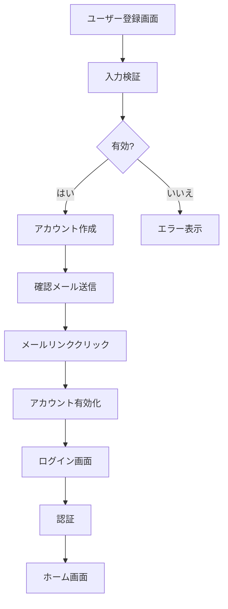

# SightEdit - 機能詳細

SightEdit Chrome Extensionの全機能の詳細説明です。

## 📝 エディター機能

### WYSIWYGモード
- **見たままの編集**: Markdownの記号を意識せずに編集
- **リッチテキスト編集**: 太字、斜体、取り消し線、コードなど
- **インライン編集**: テキストを選択して直接フォーマット変更
- **リアルタイムレンダリング**: 入力と同時に結果を表示

### ソースモード
- **Markdown記法の直接編集**: プレーンテキストでの編集
- **シンタックスハイライト**: Markdown記法の視覚的強調
- **行番号表示**: コードエディター風の表示
- **ショートカット対応**: Markdown記号の素早い入力

### 基本編集機能
- **見出し**: H1〜H6レベル
- **リスト**: 箇条書き、番号付きリスト
- **引用**: ブロッククオート
- **コードブロック**: シンタックスハイライト付き
- **表**: Markdownテーブル
- **水平線**: セクション区切り
- **リンク**: URLとテキストのリンク
- **画像**: 3種類の挿入方法（後述）

### ツールバー
- **直感的操作**: クリックでMarkdown要素を挿入
- **アイコンベース**: 分かりやすいビジュアル表示
- **レスポンシブ**: 画面サイズに応じたレイアウト調整

## 🤖 AI機能

### 対応AIプロバイダー

#### Google Gemini
- **Gemini 2.5 Pro** (推奨): 高性能・無料枠あり
- **Gemini 2.0 Flash**: 最新・高速・無料枠あり
- **Gemini 2.0 Flash Exp**: 実験版・最新機能
- **Gemini 1.5 Flash**: 高速・無料枠あり
- **Gemini 1.5 Pro**: 高性能・無料枠あり

#### Anthropic Claude
- **Claude Sonnet 4**: Artifacts対応・認証不要（一部機能）
- **Claude Haiku**: 高速・コスト効率
- **Claude Opus**: 最高性能

### AIチャット機能

#### 基本機能
- **リアルタイムストリーミング**: 応答が逐次表示
- **Markdown対応**: リッチテキストで応答表示
- **コードブロック**: シンタックスハイライト付き
- **XSS保護**: DOMPurifyによる安全な表示

#### コンテキスト連携
- **なし**: 単独の質問・会話
- **選択範囲**: 選択したテキストを含めて質問
- **ドキュメント全体**: 文書全体をコンテキストとして使用

#### 会話履歴管理
- **IndexedDB保存**: ローカルに永続化
- **セッション管理**: 複数の会話を個別管理
- **お気に入り**: 重要な会話をマーク
- **検索機能**: タイトルや内容で検索
- **フィルター**: すべて/お気に入り/今日/今週

#### キーボードショートカット
- `Ctrl+K` (Cmd+K): チャットパネルのトグル
- `Ctrl+L` (Cmd+L): 会話クリア
- `Ctrl+Enter`: メッセージ送信

### AI編集機能

#### テキスト処理
- **要約**: 長文を簡潔にまとめる
- **校正**: 誤字脱字・文法チェック
- **翻訳**: 英語⇔日本語の双方向翻訳

#### 文体変換（20+種類）
1. **エッセイ調**: 穏やかで涼気な文体
2. **論文調**: 学術的で厳格な文体
3. **ビジネス調**: フォーマルなビジネス文体
4. **カジュアル調**: 親しみやすい口調
5. **丁寧語調**: より丁寧な敬語表現
6. **簡潔調**: 簡潔で要点を絞った表現
7. **詳細調**: より詳しく具体的な説明
8. **説明調**: 分かりやすい解説口調
9. **感情豊か調**: 感情表現豊かな文体
10. **客観調**: 客観的で中立的な表現
11. **主観調**: 個人的な意見を含む表現
12. **専門用語調**: 専門的な用語を使用
13. **一般向け調**: 一般的で分かりやすい表現
14. **話し言葉調**: 口語的な表現
15. **書き言葉調**: 文語的な表現
16. **積極調**: 前向きで積極的な表現
17. **慎重調**: 慎重で控えめな表現
18. **創造的調**: 創意工夫のある表現
19. **分析的調**: 論理的で分析的な表現
20. **その他**: カスタム指定

#### 文書作成支援
- **タイトル生成**: 内容に合ったタイトル提案
- **見出し生成**: 構造化された見出し提案
- **導入文生成**: 効果的な導入部分の作成
- **結論生成**: まとまりのある結論部分の作成
- **キーワード抽出**: 重要キーワードの自動抽出

## 📊 AI図生成機能

### Mermaid図生成

#### 対応する図タイプ
1. **フローチャート**: 処理の流れを表現
2. **シーケンス図**: システム間の相互作用
3. **クラス図**: オブジェクト指向設計
4. **ER図**: データベース設計
5. **ガントチャート**: プロジェクトスケジュール
6. **状態遷移図**: 状態の変化を表現
7. **円グラフ**: データ分布を表現

#### 使用方法
1. 図生成ダイアログを開く
2. Mermaidタブを選択
3. 自然言語で図の内容を説明
4. テンプレートを選択（オプション）
5. AIで生成ボタンをクリック
6. プレビューで確認
7. 挿入ボタンでエディターに挿入

#### 例
**入力**: 「ユーザー登録からログインまでのフロー図を作成して」

**生成される図**:

### Chart.js グラフ生成

#### 対応するグラフタイプ
1. **棒グラフ**: データの比較
2. **折れ線グラフ**: 時系列データの推移
3. **円グラフ**: 割合の表示
4. **ドーナツグラフ**: 割合の表示（中央が空洞）
5. **レーダーチャート**: 多角的な評価
6. **散布図**: 相関関係の可視化

#### 特徴
- **AI自動設定**: 自然言語から適切なグラフ設定を生成
- **カスタマイズ可能**: 生成後にJSON設定を手動編集
- **Canvas→SVG変換**: エディターに挿入時にSVGに変換
- **リアルタイムプレビュー**: 設定変更が即座に反映

### SVG図形生成

#### 対応する図形タイプ
- **アイコン・ロゴ**: シンプルなベクター画像
- **基本図形**: 円、四角、三角など
- **カスタムイラスト**: AI生成のイラスト
- **図解**: 説明図やダイアグラム

#### 特徴
- **純粋なSVGコード**: ベクター形式で拡大縮小自在
- **軽量**: HTMLと同じテキスト形式
- **カスタマイズ性**: 生成後にSVGコードを手動編集可能

## 🖼️ 画像機能

### Google Drive統合

#### OAuth認証
- **安全な認証フロー**: Google公式OAuth 2.0
- **権限管理**: 必要最小限の権限のみ要求
- **トークン保存**: ローカルに安全に保存

#### 共有リンク対応
- **URLパターン認識**: 複数の共有リンク形式に対応
- **自動変換**: 表示可能URLに自動変換
- **プレビュー**: 挿入前に画像を確認

#### 使用手順
1. Google Driveで画像を右クリック → 「共有」
2. 「リンクを知っている全員」に設定
3. リンクをコピー
4. SightEditの画像挿入ダイアログに貼り付け

### ネット画像URL

#### 対応URL
- 任意の公開画像URL
- 直接表示可能な画像パス
- CORS対応サーバーの画像

#### 特徴
- **リアルタイムプレビュー**: URL入力時に即座に表示
- **エラーハンドリング**: 読み込み失敗時の適切な表示
- **タイムアウト**: 10秒で自動タイムアウト

### ローカルファイル

#### 対応形式
- PNG
- JPG / JPEG
- GIF
- SVG
- WebP

#### 特徴
- **DataURL変換**: Base64形式で埋め込み
- **ファイルサイズ制限なし**: ブラウザの制限まで対応
- **プレビュー**: 選択後すぐに確認

## 📤 エクスポート機能

### 対応形式

#### 基本形式
- **Markdown**: 元のMarkdown形式
- **HTML**: リッチテキストHTML
- **PDF**: 印刷可能なPDF
- **DOCX**: Microsoft Word形式
- **プレーンテキスト**: 書式なしテキスト

#### サービス別最適化
- **WordPress**: Gutenbergブロック対応
- **note**: リッチテキスト対応
- **Medium**: Medium形式
- **Zenn**: Zenn Markdown
- **Qiita**: Qiita Markdown
- **GitHub Pages**: Jekyll対応
- **GitHub Wiki**: Wiki形式
- **Dev.to**: Dev.to Markdown
- **小説家になろう**: ルビ対応
- **カクヨム**: カクヨム形式

### エクスポート設定
- **フォーマット選択**: 用途に応じた形式選択
- **メタデータ保存**: タイトル、作成日時など
- **文字コード**: UTF-8対応

## 🔧 設定機能

### AI設定
- **APIキー管理**: 安全な保存と管理
- **モデル選択**: プロバイダーごとのモデル選択
- **デフォルトプロバイダー**: 優先するAIを設定

### エディター設定
- **自動保存**: 編集内容の自動保存
- **行の折り返し**: 長い行の表示設定
- **ダークモード**: ダークテーマの切り替え

### エクスポート設定
- **デフォルト形式**: よく使う形式を設定
- **保存場所**: エクスポートファイルの保存先

## 🎨 UI/UXの特徴

### レスポンシブデザイン
- **画面サイズ対応**: デスクトップ、タブレット対応
- **可変レイアウト**: ウィンドウサイズに応じた最適表示

### ダークモード
- **完全対応**: すべてのUI要素がダークテーマ対応
- **目に優しい**: 長時間の作業に適した配色

### アクセシビリティ
- **キーボード操作**: マウスなしで主要機能を操作
- **スクリーンリーダー対応**: Alt属性、ARIA対応
- **コントラスト**: 読みやすい色の組み合わせ

## 🔒 セキュリティとプライバシー

### データ保護
- **ローカル保存**: すべてのデータはローカルに保存
- **外部送信なし**: AI API以外への送信なし
- **暗号化**: APIキーは安全に保存

### XSS保護
- **DOMPurify**: AI応答のサニタイズ
- **Content Security Policy**: CSP設定による保護

### プライバシー
- **データ収集なし**: ユーザーデータを収集しません
- **トラッキングなし**: アナリティクスなし
- **オフライン動作**: ネット接続不要（AI機能除く）

## 📊 パフォーマンス

### 最適化
- **遅延読み込み**: 必要な機能のみ読み込み
- **キャッシング**: 頻繁に使用するデータをキャッシュ
- **デバウンス**: 連続操作時の処理最適化

### ストレージ
- **Chrome Storage**: 設定とAPIキー
- **IndexedDB**: 会話履歴
- **LocalStorage**: 一時データ

---

**最終更新**: 2025年1月
**バージョン**: 3.0.0
