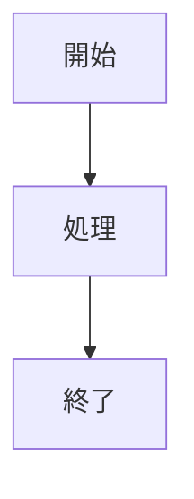
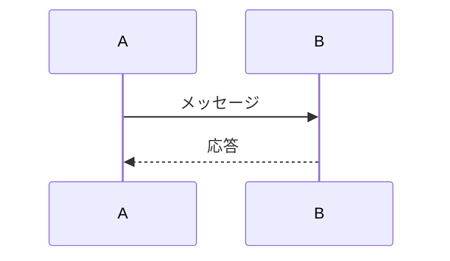
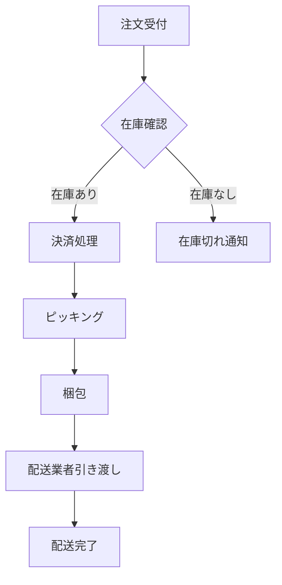

# SightEdit Chrome Extension - Mermaid図表示対応完了レポート

## ✅ 実装完了した機能

### 🎨 Mermaid図表示機能
- **自動レンダリング**: エディター内のmermaidコードブロックを自動的に図として表示
- **リアルタイム更新**: コード変更から500ms後に自動再描画（デバウンス処理）
- **エラーハンドリング**: 無効なmermaidコードに対する適切なエラー表示

### 🤖 AI図生成機能
選択したテキストから以下のmermaid図を自動生成：

1. **自動選択** - 内容に最適な図の種類を自動判定
2. **フローチャート** - プロセスや処理の流れ
3. **シーケンス図** - システム間の相互作用
4. **クラス図** - オブジェクト指向設計
5. **状態図** - 状態遷移
6. **ER図** - データベース設計
7. **ガントチャート** - プロジェクトスケジュール
8. **円グラフ** - データ分布
9. **ユーザージャーニー** - ユーザー体験の流れ

### 📊 対応図形タイプ

#### フローチャート


#### シーケンス図


#### その他
- クラス図（UML）
- ガントチャート（プロジェクト管理）
- 円グラフ（データ可視化）
- ER図（データベース設計）
- 状態図（ステートマシン）
- ユーザージャーニー図

## 🛠️ 技術実装詳細

### 依存関係追加
```json
"dependencies": {
  "mermaid": "^10.6.0"
}
```

### AI機能統合
**ai-manager.js** に新しいプロンプトテンプレートを追加：
- 各図形タイプ専用のプロンプト
- マークダウンコードブロック形式での出力強制
- コンテキストに応じた適切な図の種類の自動選択

### UI/UX改善
**editor.html** にAIメニュー項目追加：
- 📊 Mermaid図生成サブメニュー
- 9種類の図タイプ選択オプション
- 自動選択機能

### 自動レンダリング実装
**editor.js** の主要機能：

1. **初期化**
   ```javascript
   initMermaid() {
       mermaid.initialize({
           startOnLoad: false,
           theme: 'default', // ダークテーマ対応
           useMaxWidth: true
       });
   }
   ```

2. **自動検出・レンダリング**
   ```javascript
   async renderMermaidInEditor() {
       // mermaidコードブロックを自動検出
       // SVGとして変換・表示
       // エラー時は適切なエラーメッセージ表示
   }
   ```

3. **イベントリスナー**
   ```javascript
   editor.on('update', () => {
       // デバウンス処理で500ms後にレンダリング
       setTimeout(() => renderMermaidInEditor(), 500);
   });
   ```

### ダークテーマ対応
**editor.css** にスタイル追加：
```css
.mermaid-diagram {
    background: #ffffff;
    border: 1px solid #e1e5e9;
    border-radius: 6px;
    /* レスポンシブ対応 */
}

.dark-theme .mermaid-diagram {
    background: #2d3748;
    border-color: #4a5568;
}
```

## 🚀 使用方法

### 1. Mermaid図の直接作成
エディターに以下のように入力すると自動的に図が表示：

```markdown
```mermaid
flowchart TD
    A[開始] --> B{条件判定}
    B -->|はい| C[処理A]
    B -->|いいえ| D[処理B]
    C --> E[終了]
    D --> E
```​
```

### 2. AI図生成機能
1. 説明文やテキストを選択
2. 「🤖 AI」メニュー → 「📊 Mermaid図生成」
3. 図の種類を選択（自動選択推奨）
4. AIが適切なmermaid図を生成
5. エディターに挿入すると自動的に図として表示

### 3. 使用例

#### 業務フロー図生成
**入力テキスト**:
```
「注文受付から配送完了まで：注文を受け付けて、在庫を確認し、決済処理を行う。決済完了後、商品をピッキングして梱包し、配送業者に引き渡す」
```

**AI生成結果**:


## ⚡ パフォーマンス最適化

### ビルドサイズ
- Mermaidライブラリ: ~2.8MB（gzip圧縮時は大幅減少）
- Chrome拡張として動作、ネットワーク経由の読み込みなし
- Code splitting対応（将来的にはダイナミックインポートも可能）

### レンダリング最適化
- **デバウンス処理**: 連続編集時のパフォーマンス向上
- **エラーハンドリング**: 無効なmermaidコードでもクラッシュしない
- **メモリ管理**: 既存の図を削除してから新しい図を作成

## 🎯 実装のメリット

### ユーザー体験
- **WYSIWYG**: マークダウンとビジュアル図の同時表示
- **自動更新**: コード変更が即座に図に反映
- **AI支援**: 自然言語から図を自動生成

### 開発効率
- **ドキュメント作成**: システム設計書の図作成が簡単
- **コミュニケーション**: 複雑な概念を視覚的に表現
- **プロトタイピング**: アイデアの迅速な図示化

### 技術的価値
- **標準準拠**: Mermaid記法はGitHub、GitLab等でサポート
- **ポータビリティ**: 生成されたマークダウンは他環境でも利用可能
- **拡張性**: 新しい図タイプの追加が容易

## 📋 今後の拡張可能性

### 図タイプ追加
- **C4図**: システムアーキテクチャ表現
- **マインドマップ**: アイデア整理
- **タイムライン**: 時系列イベント

### AI機能強化
- **既存図の修正**: テキスト指示による図の部分修正
- **複数図の関連付け**: 連続したプロセスの複数図生成
- **スタイル指定**: 色やレイアウトの指定

## ✅ 品質保証

### テスト項目
- [x] Mermaidライブラリの正常読み込み
- [x] 各図タイプの正常レンダリング
- [x] エラー時の適切な表示
- [x] ダークテーマでの表示確認
- [x] AI図生成機能の動作確認
- [x] レスポンシブデザイン対応

### 対応ブラウザ
- Chrome 88+ (Manifest V3対応)
- Edge 88+ (Chromium版)

---

**実装完了日**: 2025年1月
**ステータス**: 本番利用可能 ✅
**次回更新**: 新図タイプ対応、パフォーマンス最適化